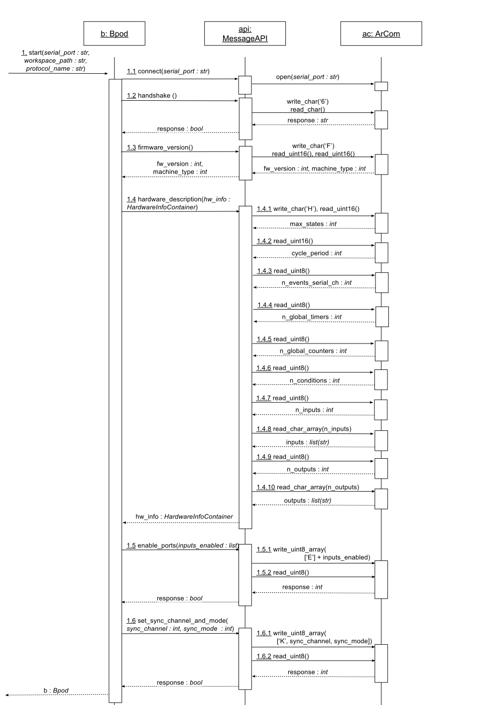
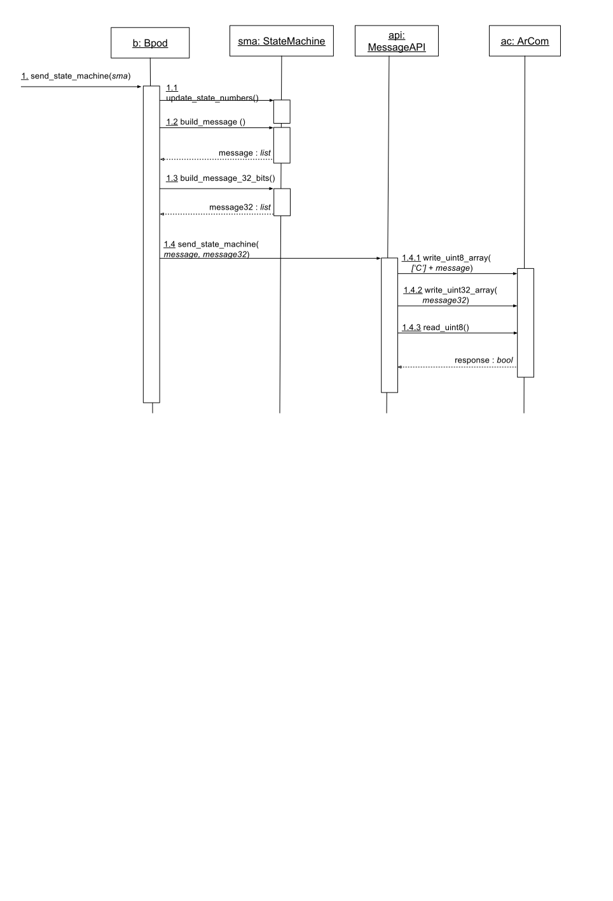
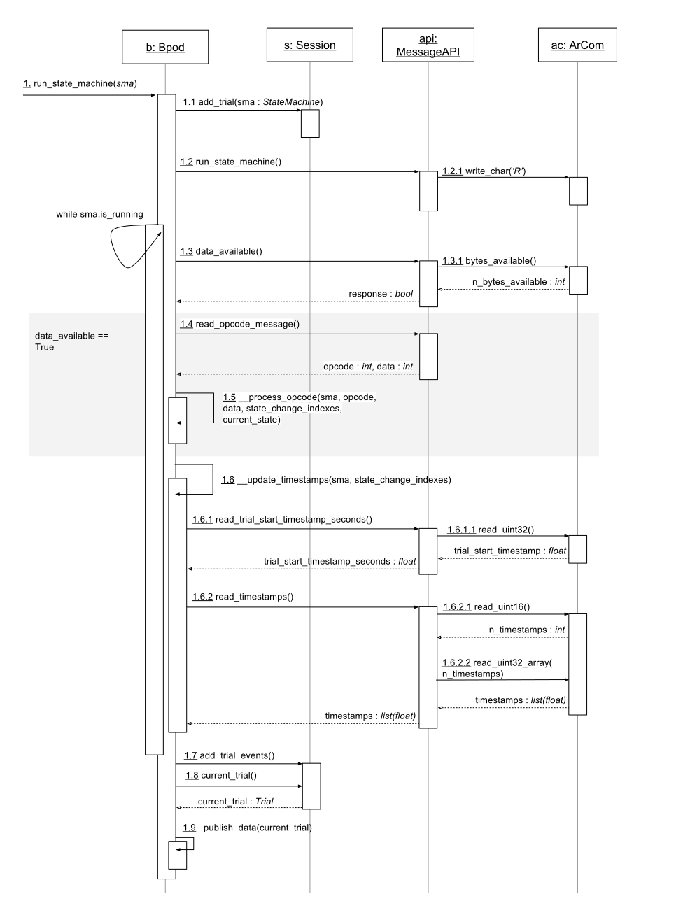

********
Diagrams
********

=============================
Class Diagrams (and modules)
=============================

Main entities
-------------

:class:`pybpodapi.bpod.Bpod`

.. inheritance-diagram:: pybpodapi.bpod.Bpod
    :parts: 1

|

:class:`pybpodapi.state_machine.StateMachine`

.. inheritance-diagram:: pybpodapi.state_machine.StateMachine
    :parts: 1

|

=================
Sequence Diagrams
=================

**Start Bpod**

**Send state machine**

**Run state machine**

